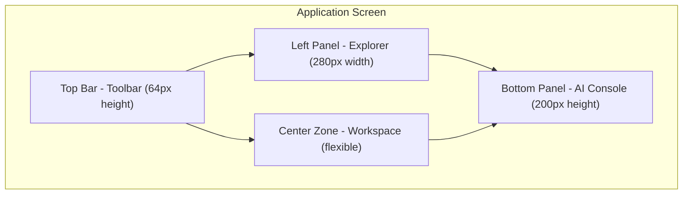
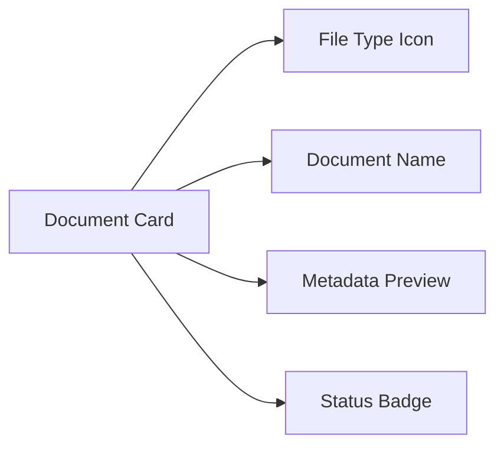
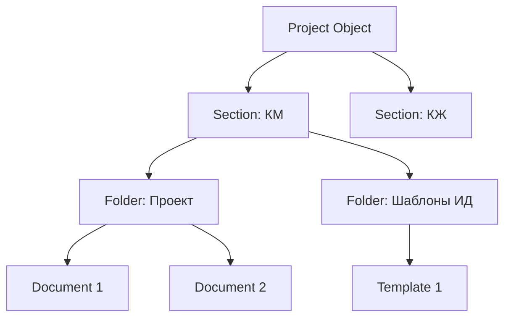
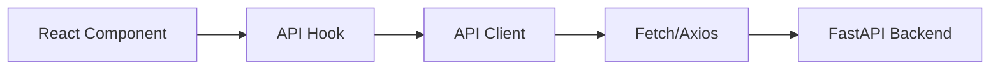
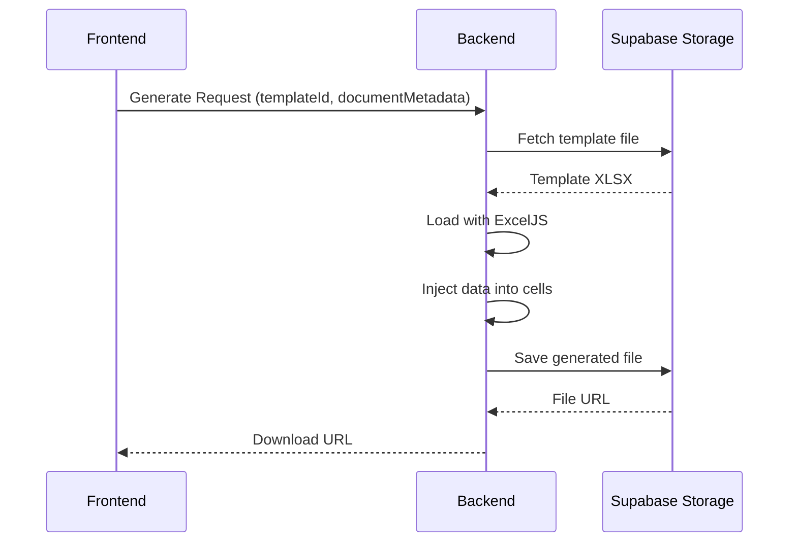
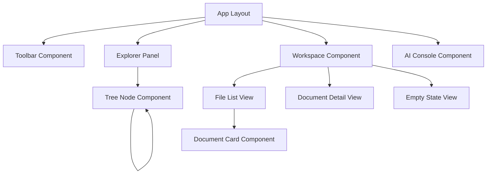

# Frontend Architecture Setup - SYNAPSE Platform

## Overview

SYNAPSE is a professional engineering platform designed for Construction Technical Office (PTO) engineers. The system provides document management, analysis, and generation capabilities with an IDE-style interface similar to VS Code or Autodesk Construction Cloud.

## System Goals

- Provide professional IDE-style interface for engineering document management
- Enable hierarchical project organization (Project > Section > Folders > Documents)
- Support future AI-powered document analysis and generation
- Establish scalable monorepo architecture for independent component development
- Deliver engineering-focused aesthetic with functional, clean design

## Architecture Strategy

### Monorepo Structure

The project uses a monorepo approach to enable independent development while maintaining integration flexibility:

| Directory | Purpose | Technology | Status |
|-----------|---------|------------|--------|
| `/apps/frontend` | Main user interface application | Next.js (App Router), TypeScript, Tailwind CSS | Full implementation |
| `/apps/backend` | API service layer | FastAPI (Python) | Basic structure only |
| `/packages/types` | Shared type definitions | TypeScript interfaces | API contracts and data models |
| `/supabase` | Database and storage | Migration schemas, table configs, Storage setup | Configuration only |

**Rationale**: This structure allows teams to work independently on frontend and backend while sharing contracts through the types package, reducing coupling and merge conflicts.

## Technology Stack

### Frontend Core

| Technology | Version | Purpose |
|-----------|---------|---------|
| Next.js | Latest (App Router) | React framework with server components support |
| TypeScript | 5.x | Type safety and developer experience |
| Tailwind CSS | 3.x | Utility-first styling system |
| Shadcn UI | Latest | Component library foundation |
| Lucide React | Latest | Technical icon system |

### UI Component Library

The following Shadcn UI components will be installed and configured:

- **Sidebar**: Explorer panel navigation
- **Card**: Content containers for documents and metadata
- **ScrollArea**: Smooth scrolling in panels
- **Button**: Action triggers (Upload, Analyze, Generate)
- **Separator**: Visual dividers between sections
- **Dialog**: Modal windows for operations

### Typography System

| Context | Font Family | Usage |
|---------|-------------|-------|
| Interface | Inter or Geist | Navigation, labels, buttons, body text |
| Technical Data | JetBrains Mono | Document IDs, metadata, bill of materials, coordinates |

**Rationale**: Monospace fonts improve readability of technical data (axes coordinates, quantities) while sans-serif fonts provide clean interface hierarchy.

## Visual Design System

### Color Palette (Engineering Aesthetic)

```
Background Layer (slate-950):  #020617
Panel Layer (slate-900):       #0f172a
Border Color (slate-800):      #334155
Accent Color (Construction):   #F59E0B
Text Primary:                  #F8FAFC
Text Secondary:                #94A3B8
```

**Usage Guidelines**:
- Accent color (#F59E0B) reserved exclusively for active states and primary action buttons
- No decorative shadows except modal windows
- Hover states use subtle background lightening
- Focus states use accent color outline

### Visual Style Rules

| Element | Style Treatment |
|---------|----------------|
| Corner Radius | `rounded-lg` (8px) for all panels and cards |
| Shadows | None for panels; `shadow-2xl` only for dialogs |
| Borders | 1px solid with border-slate-800 |
| List Hover | Background transition to slate-800 |
| Active Items | Left border accent (#F59E0B, 3px width) |

## Layout Architecture (4-Zone Structure)

### Zone Definition



### Zone Specifications

#### Left Panel (Explorer)

**Purpose**: Hierarchical navigation through project structure

**Width**: 280px fixed

**Visual Structure**:
```
Project (Object)
├─ Section (КМ - Metal Structures)
│  ├─ Folder: "Проект"
│  │  └─ Documents
│  └─ Folder: "Шаблоны ИД"
│     └─ Templates
└─ Section (КЖ - Reinforced Concrete)
   ├─ Folder: "Проект"
   └─ Folder: "Шаблоны ИД"
```

**Interaction Pattern**:
- Tree nodes expand/collapse with chevron icons
- Single click selects node and loads content in workspace
- Selected node displays accent left border
- Nested levels use 16px indentation per level

#### Top Bar (Toolbar)

**Purpose**: Primary action controls

**Height**: 64px fixed

**Action Buttons** (left to right):

| Button | Label | Icon | Function | Visual State |
|--------|-------|------|----------|--------------|
| Primary | Upload | Upload icon | Trigger file upload dialog | Accent background when active |
| Primary | Analyze | Scan icon | Initiate document analysis | Accent background when active |
| Primary | Generate | FileOutput icon | Generate reports/documents | Accent background when active |

**Layout**: Horizontal flex with 12px gap, 16px padding from edges

#### Center Zone (Workspace)

**Purpose**: Content display and interaction area

**Layout**: Flexible, fills remaining space

**Content Modes**:

1. **File List View**: Grid of document cards when folder selected
2. **Document Detail View**: Full metadata display when document selected
3. **Empty State**: Placeholder when no selection

**Document Card Structure**:



Each card displays:
- File type icon (from Lucide React)
- Document name (truncated with ellipsis if needed)
- Metadata preview: Customer, Object, Address (2 lines max)
- Status indicator: "Analyzed" / "Pending" / "Draft"

#### Bottom Panel (AI Console)

**Purpose**: Future AI assistant interface

**Height**: 200px fixed

**Current Implementation**: Placeholder component with centered text "AI Assistant (coming soon)" in secondary text color

**Visual Treatment**: 
- Clear top border separation (2px, slate-700)
- Darker background (slate-950) to distinguish from workspace
- Reserved for future chat/command interface

## Data Model

### Core Domain Entities

#### Document Entity

**Purpose**: Represents engineering documents with AI-ready metadata

| Field | Type | Description | Example |
|-------|------|-------------|---------|
| `id` | string | Unique identifier | "doc-001" |
| `name` | string | Display name | "КМ-АР.pdf" |
| `type` | enum | Document category | "project", "template", "report" |
| `uploadDate` | ISO datetime | Upload timestamp | "2024-12-25T10:30:00Z" |
| `status` | enum | Processing state | "analyzed", "pending", "draft" |
| `metadata` | DocumentMetadata | Extracted information | See below |

#### DocumentMetadata Structure

| Field | Type | Description | Example |
|-------|------|-------------|---------|
| `customer` | string | Client organization | "ООО Строй-Инвест" |
| `projectObject` | string | Construction object name | "Складской комплекс" |
| `address` | string | Physical location | "г. Москва, ул. Промышленная, 15" |
| `axes` | AxisData[] | Grid lines and marks | See AxisData |
| `elevationMarks` | number[] | Height references | [0.000, +3.600, +7.200] |
| `billOfMaterials` | BOMEntry[] | Materials list | See BOMEntry |

#### AxisData Structure

| Field | Type | Description | Example |
|-------|------|-------------|---------|
| `direction` | enum | "horizontal" or "vertical" | "horizontal" |
| `label` | string | Axis identifier | "А", "Б", "1", "2" |
| `position` | number | Coordinate in mm | 6000 |

#### BOMEntry Structure (Bill of Materials)

| Field | Type | Description | Example |
|-------|------|-------------|---------|
| `position` | string | Item number in list | "1" |
| `name` | string | Component designation | "Балка двутавровая 20Б1" |
| `weight` | number | Unit weight in kg | 45.5 |
| `quantity` | number | Count | 12 |
| `totalWeight` | number | Calculated total | 546.0 |

### Hierarchical Structure



**Entity Relationships**:
- One Project contains multiple Sections
- Each Section contains multiple Folders
- Folders contain Documents
- Documents reference DocumentMetadata (one-to-one)

## Mock Data Strategy

### Initial Data Set

**Purpose**: Provide realistic content for development and demonstration

**Scope**: Single project with complete hierarchy

**Project**: "Складской комплекс" (Warehouse Complex)

**Structure**:
```
Складской комплекс
├─ КМ (Metal Structures)
│  ├─ Проект
│  │  ├─ КМ-АР.pdf (Analyzed)
│  │  ├─ КМ-Ведомость.xlsx (Analyzed)
│  │  └─ КМ-Узлы.pdf (Pending)
│  └─ Шаблоны ИД
│     └─ Шаблон-КМ-Ведомость.xlsx (Template)
└─ КЖ (Reinforced Concrete)
   ├─ Проект
   │  └─ КЖ-АР.pdf (Draft)
   └─ Шаблоны ИД
      └─ Шаблон-КЖ-Ведомость.xlsx (Template)
```

**Sample Document Metadata** (КМ-Ведомость.xlsx):
```
Customer: ООО "СтройМонтаж"
Object: Складской комплекс
Address: Московская область, г. Подольск, Промзона Север
Axes: А-Д (horizontal), 1-8 (vertical)
Elevation Marks: 0.000, +3.600, +7.200, +10.800
Bill of Materials: 24 positions, total weight 18,450 kg
```

## API Integration Strategy

### Client Architecture

**Purpose**: Establish foundation for backend communication without implementing full logic

**Approach**: Contract-first design with typed interfaces

### API Client Structure



**Client Location**: `/apps/frontend/lib/api/client.ts`

**Responsibilities**:
- HTTP request configuration (base URL, headers, timeout)
- Request/response transformation
- Error handling and retry logic
- Type enforcement using shared contracts

### API Contracts

**Location**: `/packages/types/api.ts`

**Contract Categories**:

| Endpoint Category | Methods | Purpose |
|------------------|---------|---------|
| Documents | GET, POST, DELETE | CRUD operations for documents |
| Analysis | POST | Trigger AI analysis of uploaded documents |
| Generation | POST | Generate reports from templates using extracted data |
| Projects | GET, POST, PUT | Project hierarchy management |

**Example Contract Structure**:

**UploadDocumentRequest**:
- `file`: Binary file data
- `projectId`: Target project identifier
- `sectionId`: Target section identifier
- `folderId`: Target folder identifier

**UploadDocumentResponse**:
- `documentId`: Generated identifier
- `status`: Initial processing status
- `uploadedAt`: Timestamp

**AnalyzeDocumentRequest**:
- `documentId`: Document to analyze

**AnalyzeDocumentResponse**:
- `documentId`: Reference identifier
- `metadata`: Extracted DocumentMetadata object
- `confidence`: Analysis confidence score (0-1)
- `analyzedAt`: Timestamp

### ExcelJS Integration Concept

**Backend Pattern**: Template injection methodology

**Flow**:


**Key Principle**: Backend loads template using ExcelJS, writes metadata into predefined cells, returns generated document. Frontend only sends data and receives result.

## Component Architecture

### Component Hierarchy



### Component Specifications

#### App Layout Component

**Responsibility**: Define 4-zone grid structure

**Layout Strategy**: CSS Grid with fixed and flexible areas

**Grid Template**:
```
Areas:
- toolbar: 64px height, full width
- explorer: 280px width, remaining height
- workspace: flexible, remaining height
- console: 200px height, flexible width
```

**Responsive Behavior**: Not required for initial version (desktop-only interface)

#### Explorer Panel Component

**Responsibility**: Render project tree and handle navigation

**State Management**:
- `expandedNodes`: Set of node IDs currently expanded
- `selectedNode`: Currently selected node ID
- `projectData`: Hierarchical project structure

**Interactions**:
- Click chevron: Toggle node expansion
- Click node label: Select node and load content
- Keyboard navigation: Arrow keys for tree traversal

**Visual States**:
- Default: slate-900 background
- Hover: slate-800 background
- Selected: slate-800 background + accent left border
- Expanded: Rotate chevron icon 90 degrees

#### Toolbar Component

**Responsibility**: Render primary action buttons

**Button Configuration**:

Each button has:
- `label`: Display text
- `icon`: Lucide React icon component
- `onClick`: Handler function
- `disabled`: Boolean state (all disabled initially)

**Initial State**: All buttons disabled with visual indicator (reduced opacity)

**Future Enhancement**: Enable based on context (e.g., "Analyze" enabled when document selected)

#### Workspace Component

**Responsibility**: Display content based on explorer selection

**View Modes**:

1. **Empty State**: No selection
   - Centered message: "Select a folder or document to begin"
   - Placeholder icon

2. **File List**: Folder selected
   - Grid layout of DocumentCard components
   - 2-3 cards per row depending on width
   - 16px gap between cards

3. **Document Detail**: Document selected
   - Full metadata display in structured layout
   - Action buttons specific to document

**Mode Selection Logic**:
- If `selectedNode` is null → Empty State
- If `selectedNode.type === 'folder'` → File List
- If `selectedNode.type === 'document'` → Document Detail

#### Document Card Component

**Responsibility**: Display document summary in file list

**Layout Structure**:
```
┌─────────────────────────────────┐
│ [Icon]  Document Name           │
│                                 │
│ Customer: ...                   │
│ Object: ...                     │
│                                 │
│ [Status Badge]    [Date]        │
└─────────────────────────────────┐
```

**Props Interface**:
- `document`: Document object
- `onClick`: Selection handler
- `selected`: Boolean for visual state

**Visual Treatment**:
- Card background: slate-900
- Border: slate-800
- Hover: Border changes to slate-700
- Selected: Accent border

#### AI Console Component

**Responsibility**: Placeholder for future AI interface

**Current Implementation**:
- Static component with no interactions
- Display centered text message
- Visual separation from workspace

**Future Structure** (not implemented):
- Chat message list
- Input field for commands
- Status indicators for AI processing

## State Management Strategy

### Approach

**Philosophy**: Start simple, evolve as complexity grows

**Initial Strategy**: React useState and useContext for global state

**State Categories**:

| State Type | Scope | Storage | Example |
|-----------|-------|---------|---------|
| UI State | Component-local | useState | Hover states, dropdown open/closed |
| Navigation State | Global | Context | Selected node, expanded nodes |
| Data State | Global | Context + useState | Project hierarchy, documents |
| Server State | Global | Future: React Query | API responses, cache |

### Global State Structure

**Navigation Context**:
```
{
  selectedNodeId: string | null,
  expandedNodeIds: Set<string>,
  breadcrumb: NavigationNode[]
}
```

**Data Context**:
```
{
  projects: Project[],
  documents: Map<string, Document>,
  loading: boolean,
  error: Error | null
}
```

**Actions**:
- `selectNode(nodeId)`
- `toggleNodeExpansion(nodeId)`
- `loadDocuments(folderId)`
- `refreshProject(projectId)`

### Future Migration Path

When complexity increases:
- Introduce Zustand or Jotai for client state
- Integrate React Query for server state management
- Implement optimistic updates for better UX

## File Structure

### Monorepo Layout

```
/
├─ apps/
│  ├─ frontend/
│  │  ├─ app/
│  │  │  ├─ layout.tsx
│  │  │  ├─ page.tsx
│  │  │  └─ globals.css
│  │  ├─ components/
│  │  │  ├─ layout/
│  │  │  │  ├─ AppLayout.tsx
│  │  │  │  ├─ Toolbar.tsx
│  │  │  │  ├─ Explorer.tsx
│  │  │  │  ├─ Workspace.tsx
│  │  │  │  └─ AIConsole.tsx
│  │  │  ├─ explorer/
│  │  │  │  ├─ TreeNode.tsx
│  │  │  │  └─ TreeView.tsx
│  │  │  ├─ workspace/
│  │  │  │  ├─ DocumentCard.tsx
│  │  │  │  ├─ FileListView.tsx
│  │  │  │  ├─ DocumentDetailView.tsx
│  │  │  │  └─ EmptyState.tsx
│  │  │  └─ ui/
│  │  │     └─ [shadcn components]
│  │  ├─ lib/
│  │  │  ├─ api/
│  │  │  │  └─ client.ts
│  │  │  ├─ hooks/
│  │  │  │  ├─ useNavigation.ts
│  │  │  │  └─ useDocuments.ts
│  │  │  └─ utils/
│  │  │     └─ cn.ts
│  │  ├─ context/
│  │  │  ├─ NavigationContext.tsx
│  │  │  └─ DataContext.tsx
│  │  ├─ data/
│  │  │  └─ mockData.ts
│  │  ├─ types/
│  │  │  └─ index.ts
│  │  ├─ tailwind.config.ts
│  │  ├─ tsconfig.json
│  │  └─ package.json
│  └─ backend/
│     ├─ app/
│     │  ├─ main.py
│     │  └─ routers/
│     │     └─ documents.py
│     ├─ requirements.txt
│     └─ README.md
├─ packages/
│  └─ types/
│     ├─ document.ts
│     ├─ api.ts
│     ├─ index.ts
│     ├─ tsconfig.json
│     └─ package.json
├─ supabase/
│  ├─ migrations/
│  │  └─ [timestamp]_initial_schema.sql
│  └─ config.toml
├─ package.json
├─ turbo.json
└─ tsconfig.json
```

### Key File Purposes

| File | Purpose |
|------|---------|
| `apps/frontend/app/layout.tsx` | Root layout with AppLayout component |
| `apps/frontend/data/mockData.ts` | Mock project and document data |
| `apps/frontend/lib/api/client.ts` | API client with typed methods |
| `packages/types/document.ts` | Document and metadata type definitions |
| `packages/types/api.ts` | API contract interfaces |
| `apps/backend/app/main.py` | FastAPI app initialization and router registration |
| `supabase/migrations/[timestamp]_initial_schema.sql` | Database table definitions |

## TypeScript Configuration

### Type Safety Strategy

**Goal**: Maximize type coverage while maintaining developer productivity

**Strict Mode**: Enabled in all packages

**Key Settings**:
```
{
  "strict": true,
  "noUncheckedIndexedAccess": true,
  "noImplicitReturns": true,
  "noFallthroughCasesInSwitch": true
}
```

### Type Organization

**Shared Types** (`packages/types`):
- Domain models (Document, Project, Section, Folder)
- API contracts (Request/Response interfaces)
- Enums (DocumentType, Status, SectionType)

**Application Types** (`apps/frontend/types`):
- Component props interfaces
- Context state interfaces
- UI-specific types

**Import Strategy**:
```
Frontend imports from: @synapse/types
Backend imports from: packages/types (Python type hints)
```

## Non-Functional Requirements

### Performance Targets

| Metric | Target | Measurement Point |
|--------|--------|------------------|
| Initial Load | < 2 seconds | First Contentful Paint |
| Tree Expansion | < 100ms | Click to render |
| Navigation | < 50ms | Node selection to workspace update |
| File List Render | < 200ms | 50 documents |

**Optimization Strategies**:
- Virtual scrolling for large file lists
- Lazy loading of document metadata
- Memoization of tree nodes

### Browser Support

**Target**: Modern desktop browsers (last 2 versions)

- Chrome/Edge (Chromium)
- Firefox
- Safari

**Not Supported**: Mobile browsers (future consideration)

### Accessibility

**Initial Level**: Basic keyboard navigation

**Requirements**:
- All interactive elements reachable via Tab key
- Enter/Space to activate buttons
- Arrow keys for tree navigation
- ARIA labels on icon-only buttons

**Future Enhancement**: Full WCAG 2.1 AA compliance

## Development Workflow

### Setup Process

**Prerequisites**:
- Node.js 18+ and pnpm
- Python 3.10+ and pip
- Supabase CLI
- Git

**Initial Setup Steps**:
1. Clone repository
2. Install dependencies: `pnpm install`
3. Configure environment variables
4. Start frontend dev server: `pnpm dev --filter frontend`
5. Start backend dev server: `uvicorn app.main:app --reload` (from apps/backend)

### Environment Configuration

**Frontend Environment Variables**:
```
NEXT_PUBLIC_API_URL=http://localhost:8000
NEXT_PUBLIC_SUPABASE_URL=[supabase_url]
NEXT_PUBLIC_SUPABASE_ANON_KEY=[anon_key]
```

**Backend Environment Variables**:
```
DATABASE_URL=[supabase_postgres_url]
SUPABASE_URL=[supabase_url]
SUPABASE_KEY=[service_role_key]
```

### Testing Strategy

**Phase 1** (Current): Manual testing only

**Phase 2** (Future):
- Unit tests for utilities and hooks (Vitest)
- Component tests (React Testing Library)
- E2E tests for critical flows (Playwright)

## Out of Scope (Current Phase)

The following features are explicitly excluded from this implementation phase:

- ❌ User authentication and authorization
- ❌ AI analysis logic (backend implementation)
- ❌ AI generation logic (backend implementation)
- ❌ Real file upload to Supabase Storage
- ❌ Database CRUD operations
- ❌ Multi-user collaboration features
- ❌ Real-time updates
- ❌ Mobile responsive design
- ❌ Internationalization (i18n)
- ❌ Advanced search and filtering

**Rationale**: Focus on establishing solid architectural foundation and visual framework before adding complex business logic.

## Success Criteria

### Phase 1 Deliverables

The implementation is considered successful when:

1. ✅ Monorepo structure is established with all directories
2. ✅ Frontend application runs and displays 4-zone layout
3. ✅ Explorer panel shows mock project hierarchy
4. ✅ Tree navigation works (expand/collapse, selection)
5. ✅ Workspace displays file list when folder selected
6. ✅ Document cards show metadata preview
7. ✅ Visual design matches engineering aesthetic specification
8. ✅ All components are fully typed with TypeScript
9. ✅ Toolbar buttons are present (disabled state)
10. ✅ AI Console placeholder is visible

### Quality Gates

- Zero TypeScript errors
- No console errors or warnings
- Layout is stable across window resizes
- Visual design matches color palette and spacing rules
- Mock data displays correctly in all views

## Future Integration Points

### Backend Integration

**When Ready**:
- Replace mock data with API calls
- Implement actual file upload flow
- Connect analysis and generation endpoints
- Add loading and error states

### AI Features

**Preparation**:
- DocumentMetadata structure ready for AI extraction
- API contracts defined for analysis requests
- Console component designed for future chat interface

### Supabase Integration

**Database Tables** (to be migrated):
- `projects`: Project objects
- `sections`: КМ/КЖ sections
- `folders`: Folder containers
- `documents`: Document records
- `document_metadata`: Extracted metadata

**Storage Buckets**:
- `uploads`: User-uploaded files
- `templates`: ИД templates
- `generated`: AI-generated documents

## Risk Mitigation

### Technical Risks

| Risk | Impact | Mitigation |
|------|--------|------------|
| Monorepo complexity for team | Medium | Clear documentation, simple initial structure |
| Type sync between packages | Medium | Automated build steps, CI validation |
| Performance with large trees | Low | Virtual scrolling prepared in architecture |
| Mock data diverging from real API | Medium | Strict contract definitions in types package |

### Design Risks

| Risk | Impact | Mitigation |
|------|--------|------------|
| Engineering aesthetic too austere | Low | User feedback loop, design iteration capability |
| Layout inflexible for future features | Medium | Component-based design, refactoring headroom |
| Accessibility overlooked | Low | Basic keyboard nav from start, ARIA planned |

## Conclusion

This architecture establishes a professional, scalable foundation for the SYNAPSE platform. The monorepo structure enables independent development, the type-safe API contracts prevent integration issues, and the engineering-focused design provides a solid visual identity. The mock data and placeholder components allow immediate frontend development while backend and AI capabilities are built in parallel.

The system is designed to evolve: simple state management can migrate to advanced solutions, the API client can add authentication and caching, and the AI Console can transform from placeholder to full chat interface—all without architectural changes.
